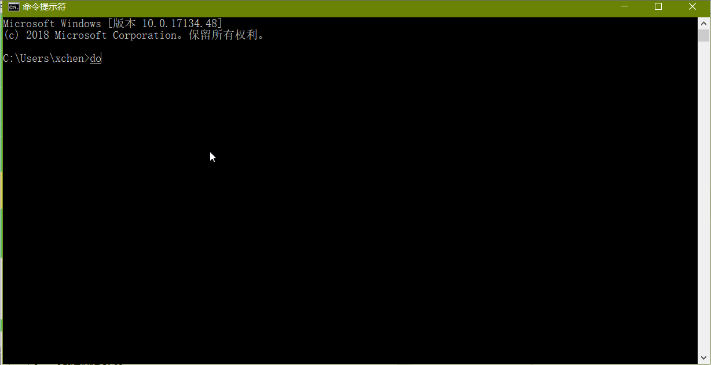
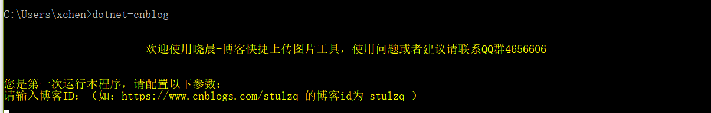
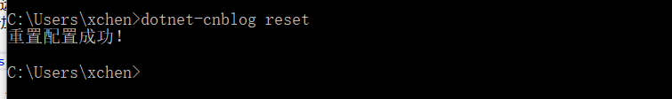
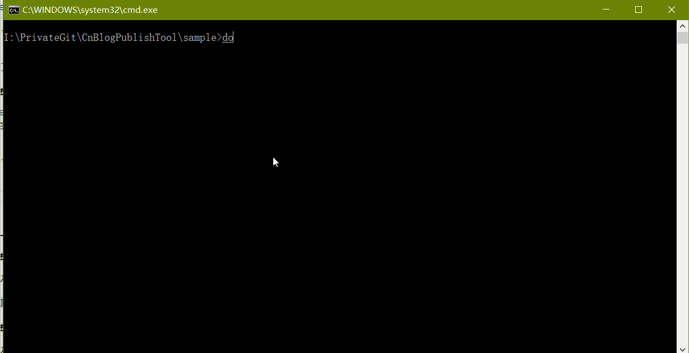
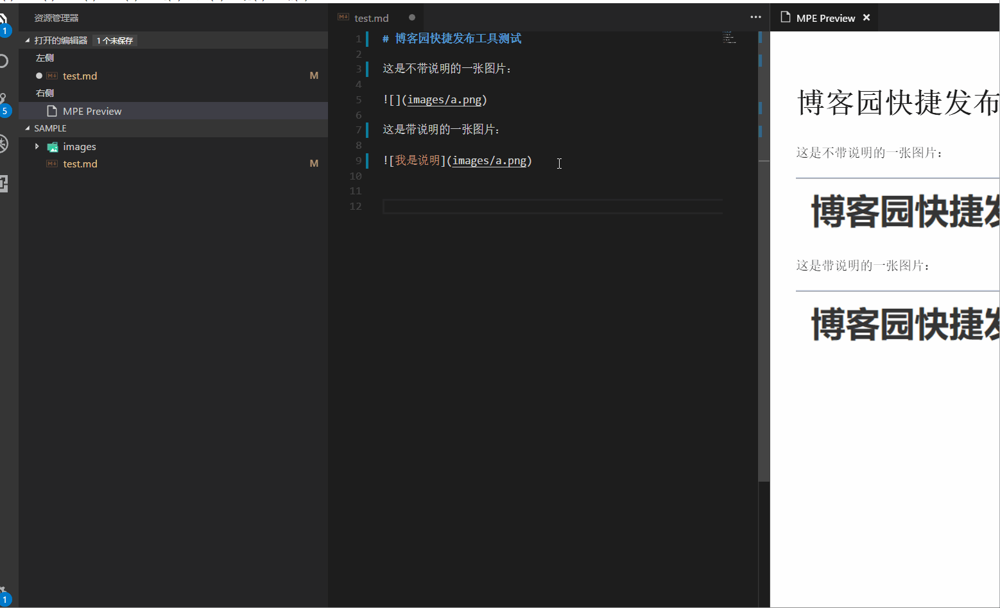

# 博客园快捷发布工具 [![NuGet][main-nuget-badge]][main-nuget]

[main-nuget]: https://www.nuget.org/packages/dotnet-cnblog/
[main-nuget-badge]: https://img.shields.io/nuget/v/dotnet-cnblog.svg?style=flat-square&label=nuget

## 一.准备环境

安装.NET Core SDK: https://www.microsoft.com/net/learn/get-started/windows

.NET Core SDK 2.1：[点我下载](https://download.microsoft.com/download/8/8/5/88544F33-836A-49A5-8B67-451C24709A8F/dotnet-sdk-2.1.300-win-gs-x64.exe)

>运行本程序必须需要.NET Core 2.1或者更高版本

## 二.第一种安装方法

.NET Core Global Tool 是 .NET Core 2.1的新特性，类似于NPM，可以直接从NUGET安装我们编写的工具。

### 1.安装

打开cmd，执行命令，便可以直接安装本工具：

````shell
dotnet tool install -g dotnet-cnblog
````



### 2.配置

第一次运行需要配置博客ID，账号密码等，按照提示输入即可，对信息采用tea加密算法进行加密存储。



### 3.重置配置

使用下面的命令重置配置:
````shell
dotnet-cnblog reset
````



### 4.使用

使用命令对Markdown文件里的图片进行解析，并上传到博客园，并且转换内容保存到新的文件中。

````shell
dotnet-cnblog <markdown文件路径>
````


## 三.第二种安装方法

### 1.编译Release包

进入`shell`文件夹，运行`publish.bat`

>可能会引起杀毒软件误报，请允许。

### 2.创建快捷方式

进入 `项目根目录\Publish` 文件夹，选中 `dotnet-cnblog.exe`，【右键菜单】->【创建快捷方式】

然后进入 `项目根目录\shell` 文件夹，运行`deploy.bat`

### 3.使用

选中一个MarkDown文件，【右键菜单】->【发送到】->【dotnet-cnblog】，便会开始解析图片并自动上传到博客园。

第一次使用会让您配置博客ID和博客园的用户名密码，密码采用tea加密存储，请放心使用。

## 四.使用演示



## 五.说明

- 程序未加过多的容错机制，请勿暴力测试。比如发送一个非MarkDown文件到程序。

- 上传图片具有重试机制，重试三次。

- 只有本地路径的图片才会上传，所有http/https远程图片都会过滤

- 图片上传完毕以后，会自动转换md内容保存到带`cnblog`后缀的文件里面

- 密码错误请到程序根目录删除`config.json`后重新运行程序，将会让你设置密码


