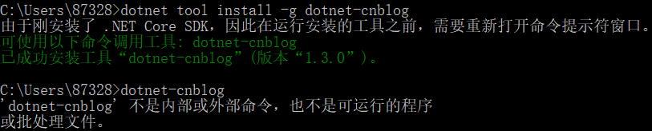
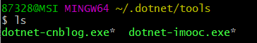

# dotNet 博客园工具 

[](https://www.nuget.org/packages/dotnet-cnblog)

## 1.安装

## 2.配置

第一次运行需要配置博客ID，账号密码等，按照提示输入即可，对信息采用tea加密算法进行加密存储。


有可能如下情况:



原因是因为你没有配置path环境变量，我们可以查看下C:\Users\用户名\\.dotnet\tools 看看是否存在 dotnet-cnblog.exe。



如果存在就把这个目录添加到path环境变量即可。


### 重置配置

使用下面的命令重置配置:
````shell
dotnet-cnblog reset
````


## 3.使用

使用命令对Markdown文件里的图片进行解析，并上传到博客园，并且转换内容保存到新的文件中。

````shell
dotnet-cnblog <markdown文件路径>
````


## 4.使用演示


## 5.说明

- 程序未加过多的容错机制，请勿暴力测试。比如发送一个非MarkDown文件到程序。

- 上传图片具有重试机制，重试三次。

- 只有本地路径的图片才会上传，所有http/https远程图片都会过滤

- 图片上传完毕以后，会自动转换md内容保存到带`cnblog`后缀的文件里面

- 密码错误请到程序根目录删除`config.json`后重新运行程序，将会让你设置密码


