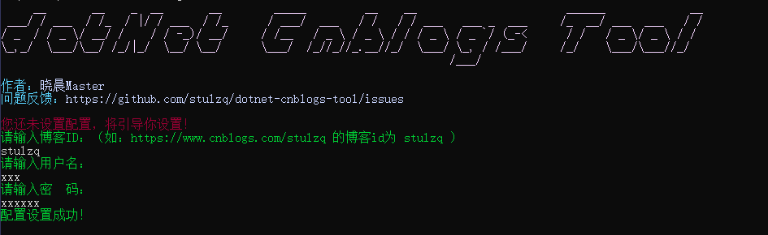
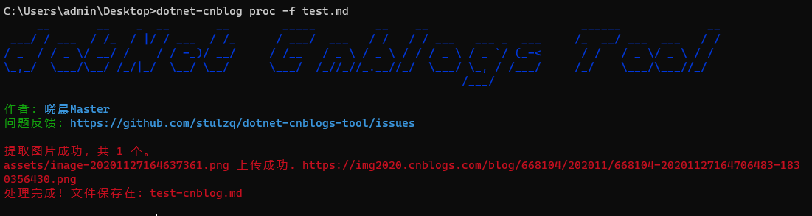

# dotNet 博客园工具 

[](https://www.nuget.org/packages/dotnet-cnblog)

## 一.前言

此工具解决的痛点是在本地编辑的 Markdown 文件里包含的图片，在博客园发布时，需要手动一张张的复制到博客园的编辑器中上传，十分麻烦，此文中有详细说明：[如何高效的编写与同步博客 （.NET Core 小工具实现）](https://www.cnblogs.com/stulzq/p/9043632.html)

## 二.安装工具

（1）具有 .NET Core/.NET 5 环境可以直接使用命令安装：

````shell
dotnet tool install --global dotnet-cnblog
````

（2）如果没有上面的环境，那么可以直接下载二进制文件 

下载地址： https://github.com/stulzq/dotnet-cnblogs-tool/releases

> 因为本工具是开源的，而且使用过程中需要输入 Token，所以不要相信任何第三方下载，因为它们有可能被植入恶意代码，仅提供上面两种方式。

## 三.使用

第一次运行需要配置博客ID，账号、Token等，按照提示输入即可，对密码采用tea加密算法进行加密存储。



>需要账号、Token 是因为调用 MetaWeblog API 需要此信息

Token 申请：https://i.cnblogs.com/settings


2022.6.29 更新，请使用 MetaWeblog Token 替换原来的账户密码！！！

### 重置配置

使用下面的命令重置配置:

````shell
dotnet-cnblog reset
````


### 四.上传图片

对Markdown文件里的图片进行解析，上传到博客园，并且转换内容保存到新的文件中。

````shell
dotnet-cnblog proc -f <markdown文件路径>
````


处理过的内容保存在 `Markdown 原始文件名-cnblog.md` 中，复制粘贴到博客园的编辑器发布即可。

## 五.其他说明

- 程序未加过多的容错机制，请勿暴力测试。比如发送一个非MarkDown文件到程序。

- 上传图片具有重试机制，重试三次。

- 只有本地路径的图片才会上传，所有http/https远程图片都会过滤

- 图片上传完毕以后，会自动转换md内容保存到带`cnblog`后缀的文件里面

- 密码错误请重置配置

若上传接口报错，请到博客园后台设置  https://i.cnblogs.com/settings


Windows 设置右键菜单的方法 https://www.cnblogs.com/shengliC/p/14410298.html
